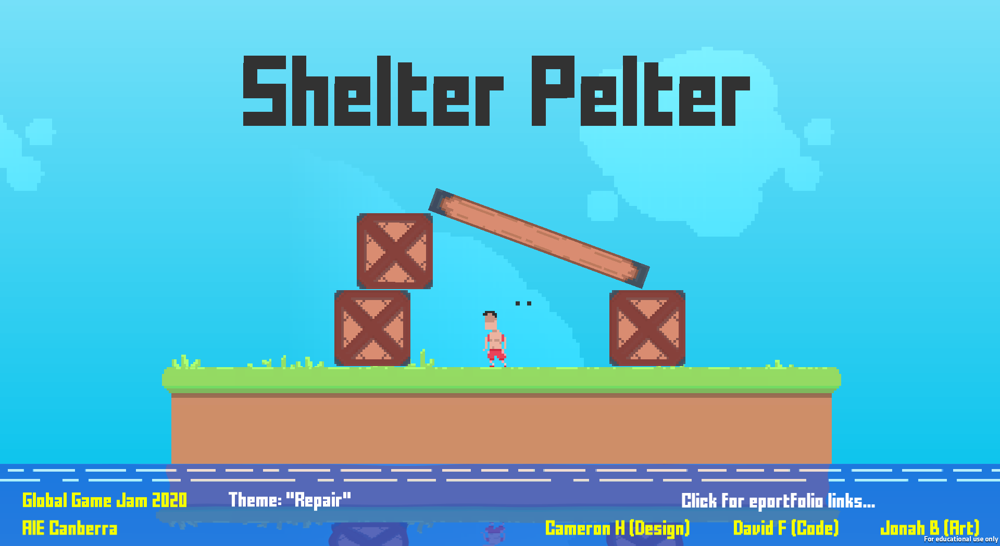
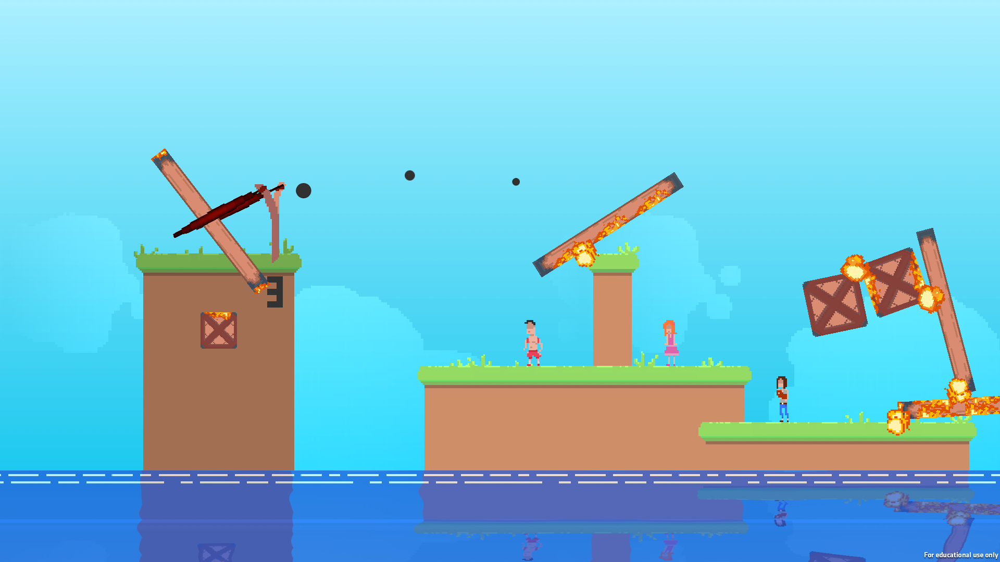
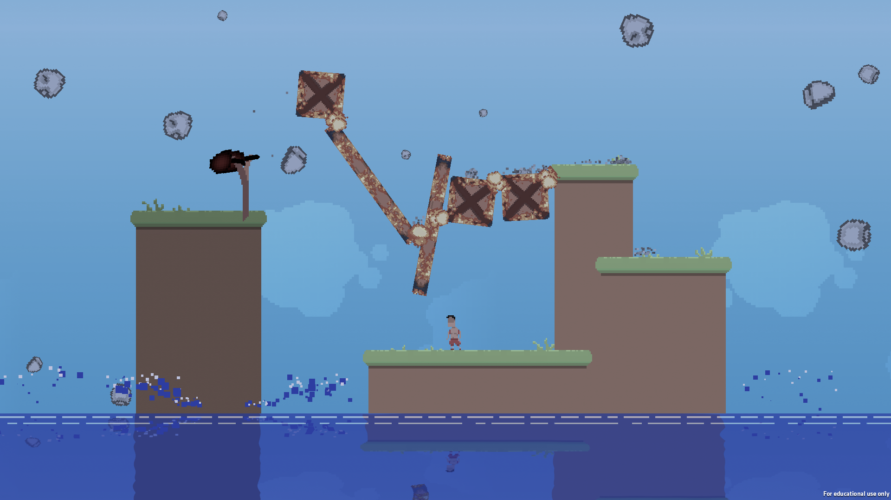

# Shelter Pelter (Global Game Jam 2020)
The game is a 2D physics-based mayhem puzzle game. Launch building materials at stranded individuals to protect them from the impending boulder storm.

The Game Jam was held at AIE Campus Canberra on February 2020. The theme of the jam was **Repair**. 
Our group consisted of three members: one artist, one designer and myself as the programmer. We were given one weekend to create a game that somewhat related to the theme.

We created our game in **C# Unity**. The game involves utilising a sling shot to send various building blocks across the level to arrange a structure. The structure must protect the villagers from the impending storm of falling rocks. There consists a start screen (with an introduction cutscene), a level select screen (that saves progress), eight hand-crafted levels, and a ninth randomly generated level.

**Shelter Pelter Gameplay Video - [LINK](https://youtu.be/SeecvpnHG9M)** 
 
**Screenshots** 

 
 

## Download & Links
The game can be downloaded from this repository or alternatively from the following sites. 
Game Jam Page: [https://globalgamejam.org/2020/games/sling-builder-5](https://globalgamejam.org/2020/games/sling-builder-5) 
Itch.io Page: [https://justcamh.itch.io/shelter-pelter](https://justcamh.itch.io/shelter-pelter) 

## Credits & Acknowledgements
### Design
- [Cameron H](https://justcamh.itch.io)
### Art
- [Jonah B](https://artstation.com/jtb)
### Programming
- David Flintoft

    
 
Academy of Interactive Entertainment Canberra 
